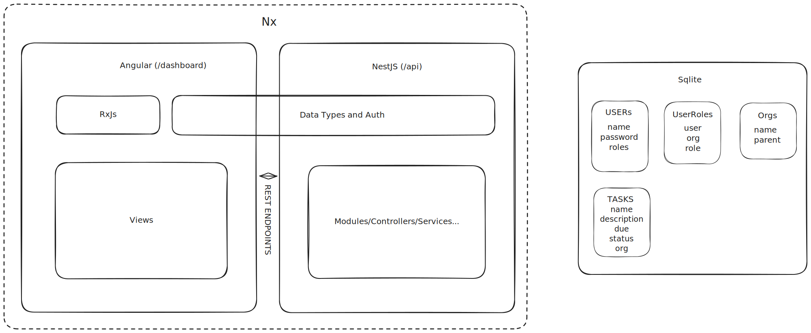
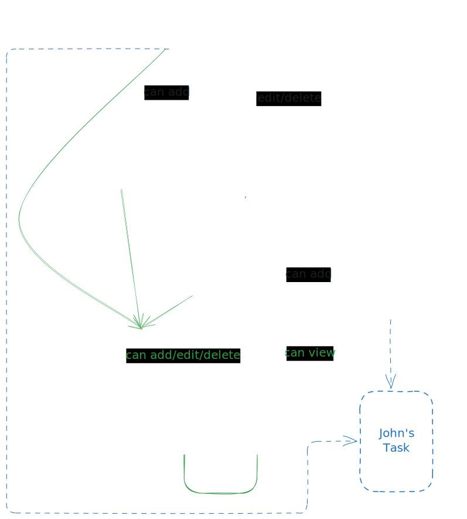

# Smart Task Manager

## Video Overview


## Setup Instructions

```sh
git clone git@github.com:p-tupe/smart-task-manager.git
npm install
mv .env.sample .env # Update .env > JWT_SECRET
nx serve api # To run backend
nx serve dashboard # To run frontend (separately)
```

● Architecture Overview



● How roles, permissions, and organization hierarchy work



```
Ideal RBAC:

Say we have a "parent-org" owned by "Jane"

> As an "owner" Jane has permissions to
full access the org, as well as add an child
org to same.

Jane adds a new "child-org-1" and "child-org-2"
orgs to parent-org, then assigns "Alice" as
owner of child-org-1 and "John" as owner of
child-org-2

> Owners also have permissions to add other
users as "admin"s to their org

Alice adds "Bob" as an administrator for child-
org-1

> Bob the admin can add/edit/delete tasks in
the org, and also add other users as "viewer"s

Bob adds John as a viewer for child-org-1

> John can now see all tasks in that org
```

```
Implemented RBAC:

Both users and orgs have been hard-coded, so rbac is only as task level for now.

> Jane's tasks are visible to noone (except Jane)
> John's tasks are visible only to John himself and Jane
> Alice and Bob's tasks are visible to everyone
```

● Endpoint list with sample requests/responses

There's the usual `POST /api/auth/login` that takes username/password and returns access_token.

access_token contains orgId, userId and username.

Using this token enables CRUD on `/api/task` assuming proper authorizaition is present.
